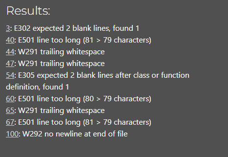

# Battleship Game

Battleship is a game created entirely using Python. 

Users guess the location of a ship by inputting 2 numbers separated by a comma. They then have 5 attempts to find the ship otherwise the game is over and the computer won.

## Game Play

The game begins with the user deciding the grid size by inputting one number so it'll be a square grid. This can be any size as long as it's at least 2, choosing 1 will result in an error message. 

The player must input 2 numbers separated by a comma and numbers must not be larger than the grid size otherwise they will get an error message.

If the user is one number away from the ship they'll get a message saying they're really close. This will help the game be more engaging creating a sense of excitement and focus knowing they were close.

The player has 5 attempts to find the ship otherwise the game is over.

## Planning

Before starting the project I created a flowchart to plan out how everything would work. This made it easier when it came to coding as I could referring back to it to understand what I should do next and making sure everything made sense and flowed correctly.

## Future Features

 - Restart game option
 - Increase number of attempts allowed based on grid size
 - Allow more than one ship

## Testing

Game has been testing in Chrome and Edge, both working fine.
All potential error messages have been tested to make sure they appear (grid size and guess input).

### Issues

I tried to put a restart game feature in but couldn't find a way to make it work in the time I had to work on it so the idea was scrapped.

### PEP8

Remaining issues that need to be fixed. Nothing major but some times I maybe should have picked up on while coding.

## Deployment

This project was deployed using [Code Institute's](https://codeinstitute.net/) mock terminal for Heroku.

 - Steps for deployment:
    - Create new Heroku app
    - Set buildbacks to Python and NodeJS in that order
    - Link Heroku app to Github repository
    - Deploy project

## Credits

[Code Institute'](https://codeinstitute.net/) for deployment terminal and deployment method.