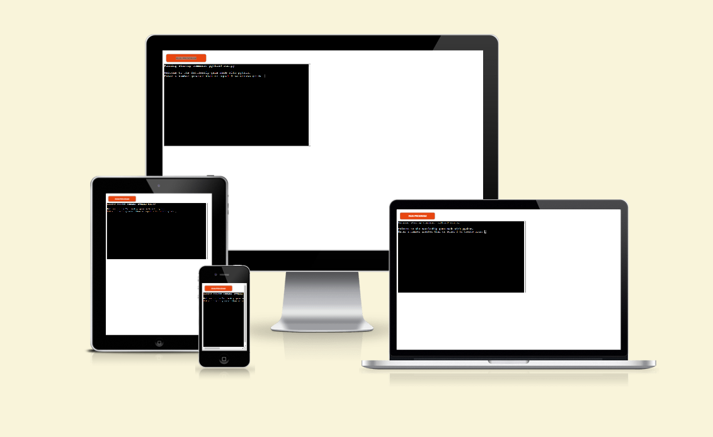

# Battleship Game

Battleship is a game created entirely using Python. 

Users guess the location of a ship by inputting 2 numbers separated by a comma. They then have 5 attemps to find the ship otherwise the game is over and the computer won.

