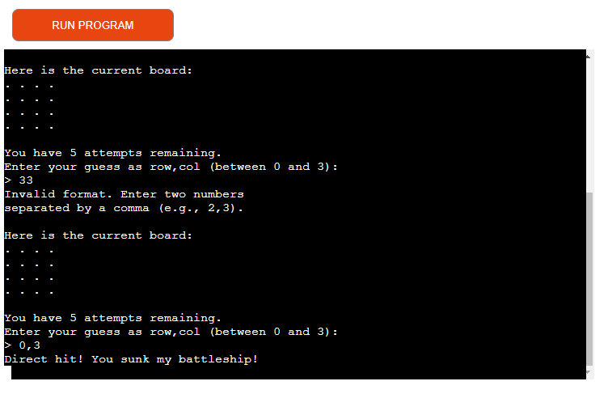

# Battleship Game

Battleship is a game created entirely using Python. 

Users guess the location of a ship by inputting 2 numbers separated by a comma. They then have 5 attempts to find the ship otherwise the game is over and the computer won.

## Game Play

The game begins with the user deciding the grid size by inputting one number so it'll be a square grid. This can be any size between 2 and 10, choosing any other number will result in an error message. 

The player must input 2 numbers separated by a comma and numbers must not be larger than the grid size otherwise they will get an error message.

An incorrect guess will result in a message saying 'Miss!' and will also display the number of attempts left.

If the user is one number away from the ship they'll get a message saying they're really close. This will help the game be more engaging creating a sense of excitement and focus knowing they were close.

The player has 5 attempts to find the ship otherwise the game is over and the location is revealed.

A correct answer will result in a message saying 'Direct hit! You sunk my battleship!

## Planning

Before starting the project I created a flowchart to plan out how everything would work. This made it easier when it came to coding as I could referring back to it to understand what I should do next and making sure everything made sense and flowed correctly.

## Future Features

 - Restart game option
 - Increase number of attempts allowed based on grid size
 - Allow more than one ship

## Testing

Game has been testing in Chrome and Edge, both working fine.

Tested to make sure invalid grid size won't be accepted.

Tested to show it won't accept letters instead of numbers.

Tested to make sure a comma is needed.

### PEP8

Previous iteration had errors but now all problems have been fixed and passes through PEP8 without any errors found.

## Deployment

This project was deployed using [Code Institute's](https://codeinstitute.net/) mock terminal for Heroku.

 - Steps for deployment:
    - Create new Heroku app
    - Set buildbacks to Python and NodeJS in that order
    - Link Heroku app to Github repository
    - Deploy project

## Credits

[Code Institute'](https://codeinstitute.net/) for deployment terminal and deployment method.